

  

<h1 align="center">Bem-vindo ao Alan-Verse 🕸️</h1>

  <strong>Computer Engineer | Data Engineering • Automation • Cloud</strong> 
  Conectando problemas reais, dados e tecnologia através da mesma teia.

  
  
  
  

<em>Transformo dados brutos em decisões e processos manuais em automações confiáveis.</em>

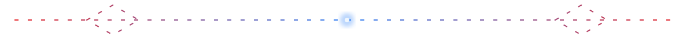

## 🕸️ A Teia | Sobre mim

<table>
  <tr>
    <td width="62%" valign="middle">
      <h3>Uma trajetória, vários pontos conectados</h3>
      
Sou formado em <strong>Engenharia da Computação</strong> pela Universidade Positivo. Minha base veio do suporte técnico N2: investigar incidentes, analisar sinais, encontrar causas e documentar soluções.

      
Hoje levo essa visão operacional para <strong>Engenharia de Dados</strong>. Construo pipelines, automações e projetos orientados a problemas reais, trabalhando principalmente com Python, SQL, qualidade de dados, containers e Cloud.

      <ul>
        <li>📍 Curitiba, Paraná</li>
        <li>🔎 Suporte N2, diagnóstico e automação</li>
        <li>🐍 Python, SQL e APIs REST</li>
        <li>☁️ Cloud e containers em evolução</li>
        <li>🏎️ Automobilismo, telemetria e café</li>
        <li>🌐 Inglês intermediário</li>
      </ul>
    </td>
    <td width="38%" align="center" valign="middle">
      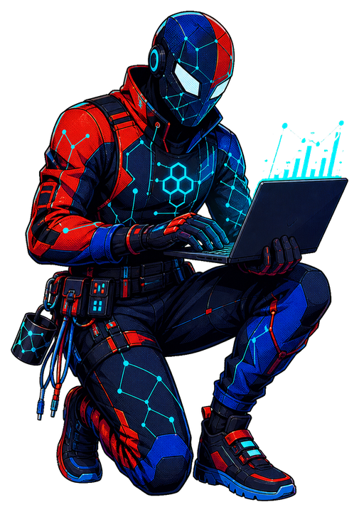
    </td>
  </tr>
</table>

> Assim como uma teia conecta diferentes pontos, minha trajetória conecta **suporte, automação, dados, Cloud e engenharia**.

## ⚡ Spider-Sense | Como trabalho

Meu “sentido-aranha” profissional não prevê o futuro — ele procura o sinal que explica o problema.

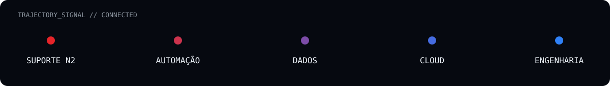

| Sinal detectado | Resposta de engenharia |
|---|---|
| Um comportamento estranho | Reproduzo, investigo a causa e analiso logs |
| Dados inconsistentes | Crio validações, contratos e testes de qualidade |
| Uma rotina repetitiva | Automatizo com regras claras e observáveis |
| Uma necessidade operacional | Traduzo em uma solução prática e documentada |
| Uma falha no pipeline | Trato o erro como informação, não como surpresa |

easter egg // com grandes dados vêm grandes responsabilidades.

## 🌐 Web of Projects | Projetos em destaque

Cada repositório é uma dimensão do Alan-Verse: um problema diferente conectado pela mesma forma de pensar.

<a href="https://github.com/alankordel/kordel-racing-data-lab">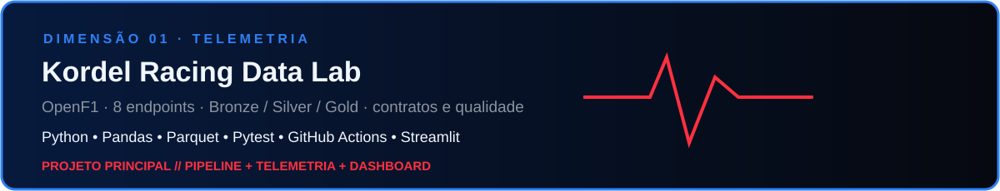</a>

<a href="https://github.com/alankordel/sql-analytics-ecommerce-simulation">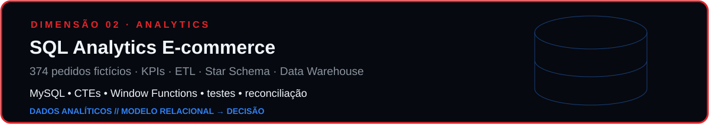</a>

<a href="https://github.com/alankordel/hunter-job-for-me">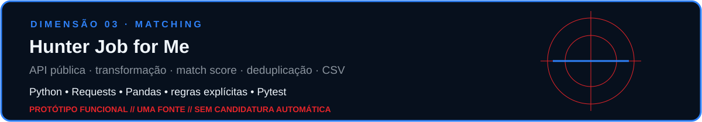</a>

<a href="https://github.com/alankordel/monitor-precos-estoque">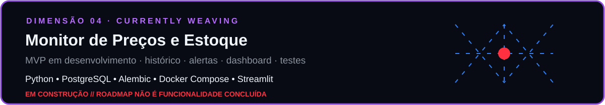</a>

  
<strong>Outra conexão da teia: suporte e automação</strong>

   
  O <a href="https://github.com/alankordel/office-troubleshooting-script">Office Troubleshooting Script</a> representa minha origem operacional: diagnóstico do Microsoft Office em Windows, geração de logs e rotinas automatizadas de reparo.

## 🧰 Tech Web | Tecnologias

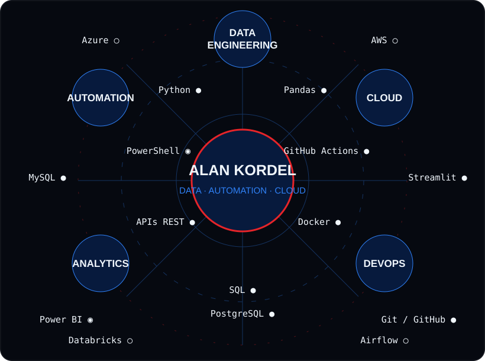

  <strong>● Em projetos</strong> &nbsp; <strong>◉ Uso profissional</strong> &nbsp; <strong>○ Em evolução</strong>

## 📡 Signals Across the Multiverse | GitHub Stats

  
  

> Os números mudam; as evidências ficam nos projetos, testes e decisões documentadas acima.

## 🕷️ Contribution Web

  

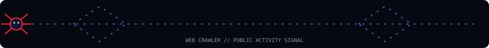

## 🧵 Currently Weaving | Em construção

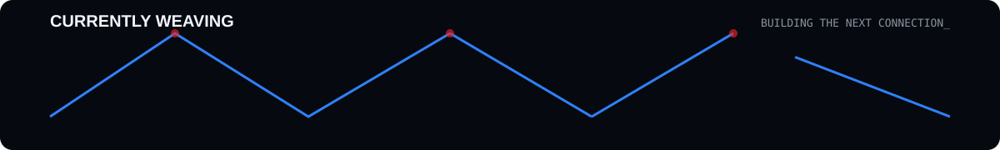

- **Monitor de Preços e Estoque:** evolução do MVP com PostgreSQL, Alembic, Docker Compose, alertas, dashboard e testes.
- **Kordel Racing Data Lab:** novos contratos e validações entre datasets no pipeline de telemetria.
- **Engenharia de Dados:** qualidade, arquitetura de pipelines e observabilidade.
- **Cloud e DevOps:** containers, integração contínua e fundamentos de Azure e AWS.
- **Próximos nós:** Databricks e Airflow como tecnologias em evolução.

## 🕸️ Send the Signal | Contato

<h3 align="center">Let's connect across the Data-Verse.</h3>

  <a href="https://www.linkedin.com/in/alan-kordel-b3366115b/">LinkedIn</a>
  &nbsp;•&nbsp;
  <a href="mailto:alan.kordel@outlook.com.br">alan.kordel@outlook.com.br</a>
  &nbsp;•&nbsp;
  <a href="https://github.com/alankordel">GitHub</a>

Alan-Verse // onde operações, dados e engenharia se conectam.

