<p align="center">
  
</p>

<p align="center">
  <strong>Transformo sinais dispersos em sistemas confiáveis — e café em commits.</strong>
</p>

<p align="center">
  <a href="#a-teia">A Teia</a> •
  <a href="#o-arsenal">O Arsenal</a> •
  <a href="#projetos-que-resistem">Projetos</a> •
  <a href="#diário-do-caçador">Trajetória</a> •
  <a href="#sinal-aberto">Contato</a>
</p>

## A Teia

Sou formado em **Engenharia da Computação** e aprendi tecnologia pelo lado operacional: investigando incidentes, entendendo comportamentos estranhos e organizando soluções. Hoje conecto essa experiência a **Data Engineering, Automação e Cloud** para construir fluxos que sejam claros, testáveis e confiáveis.

> Cada projeto conecta um problema real, uma tecnologia adequada e uma solução que pode evoluir.

<p align="center">
  
</p>

## O Arsenal

Ferramentas têm propósito. Escolho cada uma pelo tipo de problema que preciso enfrentar — e separo o que já demonstro em projetos do que ainda está em evolução.

| Missão | Ferramentas em campo | Próximas forjas |
|---|---|---|
| **Dados e pipelines** | Python, Pandas, ETL, Parquet | Databricks, Airflow |
| **SQL e bancos** | SQL, PostgreSQL, MySQL, Star Schema | — |
| **Automação e integração** | APIs REST, Requests, PowerShell, Batch | — |
| **Cloud e containers** | Docker, Docker Compose | Azure, AWS |
| **Qualidade e entrega** | Pytest, Ruff, Git, GitHub Actions | — |
| **Visualização e análise** | Streamlit, Plotly, Power BI | — |

## Projetos que resistem

Não trato repositórios como vitrines descartáveis. Meus projetos registram decisões, limitações, testes e os próximos passos.

### 🏎️ [Kordel Racing Data Lab](https://github.com/alankordel/kordel-racing-data-lab) `PROJETO PRINCIPAL`

Pipeline de dados de Fórmula 1 que ingere **oito endpoints da OpenF1**, atravessa as camadas **Bronze, Silver e Gold** e transforma telemetria em análises de ritmo, pneus e pit stops.

`Python` `Pandas` `Parquet` `Data Contracts` `Pytest` `GitHub Actions` `Streamlit`

**Sinais de resistência:** contratos e validações de qualidade, relatórios de erros e warnings, testes sem internet, CI e decisões de arquitetura documentadas.

---

### 📊 [SQL Analytics E-commerce](https://github.com/alankordel/sql-analytics-ecommerce-simulation) `MISSÃO CONCLUÍDA`

Laboratório de SQL analítico construído sobre **374 pedidos fictícios**. Parte do modelo relacional, passa por KPIs e chega a um Data Warehouse com Star Schema.

`MySQL` `CTEs` `Window Functions` `ETL` `Data Warehouse` `Reconciliação`

**Sinais de resistência:** carga idempotente, testes de integridade e reconciliação financeira entre origem e modelo dimensional.

---

### 🧭 [Hunter Job for Me](https://github.com/alankordel/hunter-job-for-me) `PROTÓTIPO FUNCIONAL`

Pipeline que consome a API pública da Remotive, transforma vagas, calcula um score de compatibilidade por regras explícitas, remove duplicidades e exporta os resultados para CSV.

`Python` `API REST` `Pandas` `Regras de score` `Pytest`

**Limite conhecido:** usa uma única fonte e não realiza candidaturas automáticas.

## Diário do Caçador

```text
[ocorrência] Suporte técnico
      ↓ investigação, logs e causa raiz
[evolução]   Automação
      ↓ menos repetição, mais consistência
[rota atual] Dados → Cloud e Engenharia
```

Investigar incidentes me ensinou a não confiar apenas no sintoma. Eu procuro rastros, reproduzo o problema e documento o caminho. Essa mentalidade segue comigo ao desenhar pipelines: observar, validar, automatizar e tornar falhas compreensíveis.

O [Office Troubleshooting Script](https://github.com/alankordel/office-troubleshooting-script) é um registro dessa origem: diagnóstico do Microsoft Office em Windows, geração de logs e rotinas de reparo automatizadas.

## Em preparo

<p align="center">
  
</p>

Na bancada está o [Monitor de Preços e Estoque](https://github.com/alankordel/monitor-precos-estoque), **em desenvolvimento**. O MVP já reúne coleta com adapter demonstrativo, histórico no PostgreSQL, CLI, alertas, execução periódica, dashboard, migrations e testes.

`Python` `PostgreSQL` `Alembic` `Docker Compose` `Streamlit` `GitHub Actions`

Novos adapters, API REST e Cloud permanecem no roadmap — são a próxima extração, não funcionalidades concluídas.

## Volta rápida

| Indicador | Leitura |
|---|---|
| **Formação** | Engenharia da Computação — Universidade Positivo |
| **Traçado atual** | Data Engineering • Automation • Cloud |
| **Carro-chefe** | Kordel Racing Data Lab |
| **Stack central** | Python • SQL • PostgreSQL • Docker • GitHub Actions |
| **Base** | Curitiba, Paraná, Brasil |
| **Sinal** | Aberto a networking e oportunidades em tecnologia |

## Sinal aberto

Se você também gosta de transformar operações complexas em sistemas organizados, o canal está aberto.

<p align="center">
  <a href="https://www.linkedin.com/in/alan-kordel-b3366115b/">LinkedIn</a>
  &nbsp;•&nbsp;
  <a href="mailto:alan.kordel@outlook.com.br">Outlook</a>
  &nbsp;•&nbsp;
  <a href="https://github.com/alankordel">GitHub</a>
</p>

<p align="center"><sub>Problemas deixam rastros. Engenharia transforma rastros em sinais.</sub></p>
